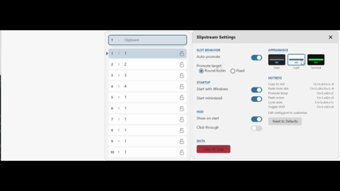
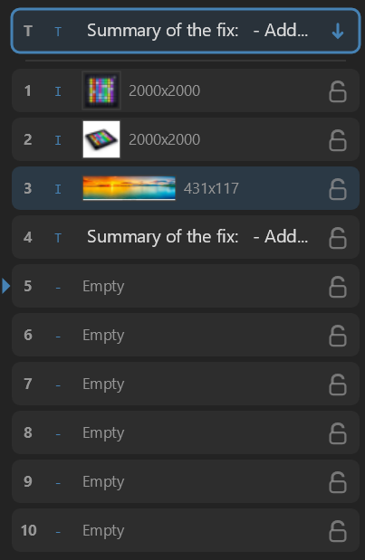
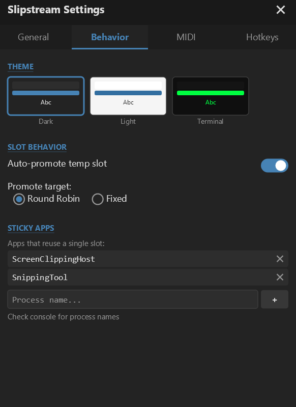

<p align="center">
  
</p>

# Slipstream

A lightweight, high-performance clipboard manager for Windows that gives you superpowers without getting in your way.

**[Download Slipstream](https://github.com/chris-arsenault/slipstream/releases/latest)** — grab the installer or portable exe and start using it in seconds.

<p align="center">
  
</p>

## Why Slipstream?

Ever copy something, then copy something else, and realize you just lost that first thing forever? Or find yourself constantly switching between documents to copy-paste multiple items one at a time?

Slipstream fixes that. It quietly watches your clipboard and gives you 10 numbered slots to store and retrieve content instantly—all through keyboard shortcuts that become second nature.

## How It Works

Slipstream introduces a simple two-tier system:

1. **Temp Slot** - Every time you copy something (`Ctrl+C`), it lands here automatically
2. **Numbered Slots (1-10)** - Permanent storage you control directly

The temp slot is your clipboard's short-term memory. Numbered slots are for things you want to keep around.

## Keyboard Shortcuts

| Action | Shortcut | Numpad |
|--------|----------|--------|
| Copy directly to slot 1-10 | `Ctrl+Alt+1` through `Ctrl+Alt+0` | `Ctrl+Alt+Numpad` |
| Paste from slot 1-10 | `Ctrl+Shift+1` through `Ctrl+Shift+0` | `Ctrl+Numpad` |
| Promote temp slot to next numbered slot | `Ctrl+Alt+C` | |
| Paste from active slot | `Ctrl+Alt+V` | |
| Cycle through slots | `Ctrl+Alt+Up/Down` | |
| Toggle HUD visibility | `Ctrl+Alt+H` | |

**Numpad users**: Numpad shortcuts require NumLock to be on.

## The HUD

<p align="center">
  
</p>

Toggle the HUD via system tray or `Ctrl+Alt+H`. It shows:

- **T** (Temp slot) - What you last copied, with a promote button
- **1-10** - Your numbered slots with content previews
- **Lock icons** - Click to protect slots from being overwritten
- **Arrow indicator** - Shows which slot will receive the next promotion (in Round Robin mode)
- **Image thumbnails** - Visual preview of copied images with dimensions

The HUD stays out of your way—drag it anywhere, and it remembers its position.

## MIDI Controller Support

<p align="center">
  
</p>

Slipstream supports MIDI controllers for hands-free clipboard management. Map any MIDI note to paste, copy, or control actions.

**Features:**
- Visual piano keyboard editor for creating custom mappings
- Preset support for popular controllers (Launchkey Mini, etc.)
- Real-time MIDI input visualization
- **Copy Modifier** - Hold one key to transform paste actions into copy actions

**Setup:**
1. Open Settings > MIDI section
2. Select your MIDI device from the dropdown
3. Choose a preset or click "New" to create custom mappings
4. Map notes to actions: Paste/Copy slots 1-10, Toggle HUD, Cycle slots, and more

## Settings

<p align="center">
  
</p>

Right-click the tray icon and select Settings to configure:

- **Slot Behavior** - Auto-promote and Round Robin vs Fixed mode
- **Startup** - Launch with Windows, start minimized
- **HUD** - Show on startup, click-through mode
- **Appearance** - Choose from Dark, Light, or Terminal themes
- **MIDI** - Device selection and preset management
- **Data** - Clear all slots, reset hotkeys

Settings and window positions are saved automatically.

## Slot Behavior Modes

**Round Robin** (default): When you promote from temp slot, content fills slots sequentially: 1 → 2 → 3 → ... → 10 → 1. Locked slots are skipped.

**Fixed**: Promotions always go to the currently active slot. Use `Ctrl+Alt+Up/Down` to choose which slot receives content.

## Auto-Promote

Enable this in settings if you want every clipboard copy to automatically save to a numbered slot. Combined with Round Robin mode, this gives you a classic clipboard history that keeps your last 10 copies.

## Supported Content Types

- Plain text
- Rich text (RTF)
- HTML
- Images (with thumbnail preview)
- File lists

Slipstream preserves formatting when pasting rich content.

## Installation

**[Download Latest Release](https://github.com/chris-arsenault/slipstream/releases/latest)**

- **Portable** - Single .exe, no installation required. Just run it.
- **Installer** - Sets up Start Menu and Desktop shortcuts.

After running, look for the **S** icon in your system tray. Right-click for settings or to quit.

## Building from Source

Requires .NET 8 SDK.

```bash
git clone https://github.com/chris-arsenault/slipstream.git
cd slipstream
dotnet build
dotnet run --project src/Slipstream/Slipstream.csproj
```

Run tests:
```bash
dotnet test
```

## Tech Stack

- **.NET 8** / WPF (windowing only)
- **SkiaSharp** for all UI rendering
- **NAudio** for MIDI controller support
- Windows clipboard APIs via P/Invoke
- Zero external runtime dependencies

## License

MIT License - See [LICENSE](LICENSE) for details.

---

*Slipstream is designed to be invisible until you need it. No bloat, no subscriptions, no cloud sync, no telemetry. Just a clipboard that actually works for you.*

<p align="center">
  
</p>
